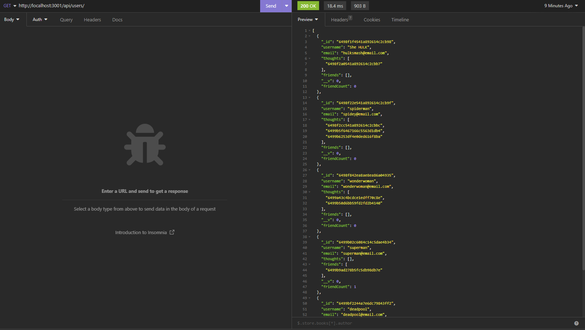

# Social-Media-API
  
  ## Description
  This social media API allows users to create users, create thoughts, react to other thoughts, add friends and more. The purpose of creating this application was to create a fully functioning API that utilized MongoDB and Mongoose. It was a very rewarding experience as I learned a lot and continue to grow my skills with databases.

  

  ## Table of Contents
  * [Installation](#installation)

  * [Usage](#usage)

  * [License](#license)

  * [Contributing](#contributing)

  * [Questions](#questions)

  * [Credits](#credits)

  

  ## Installation
  Clone the repository onto your local machine. Open the file in your preferred code editor. First, open an integrated terminal and type npm i to install all dependencies. Once dependencies are installed, type npm start to initialize the server. You then can open your server up inside of insomnia to test your routes.
    
  ## Usage
 Once you have started the server you can open a POST request and type in http://localhost:3001/api/users/. Select the body tag and select JSON. From here, you can start by creating some users to seed your database like so. 

 {
    "username": "She-Hulk",
    "email": "she-hulk@email.com"
 }

 Once you type in the user you want to create, click send and it will return the user that you created. 

 If you would like a demonstration of how to call each route, a link to a demonstration video is below. 

 Video Link: https://drive.google.com/file/d/1_ZczpaYMAo21kH6s0LfQ86-FCsAymX3o/view

  Below is a screenshot of the API running in Insomnia.

  
  
  
  ## License
  Notice: This application is covered under the  license.

  ## Contributing
  At this time there are no plans to include contributions to this project. 
  
  ## Questions
  Please reach out to me below if you have any questions.

  
  GitHub: [adamhood15](https://github.com/adamhood15)

  Email: adamhood15@gmail.com
  
  ## Credits
  I am the sole collaborator on this project. Rice University provided the starter code. 

